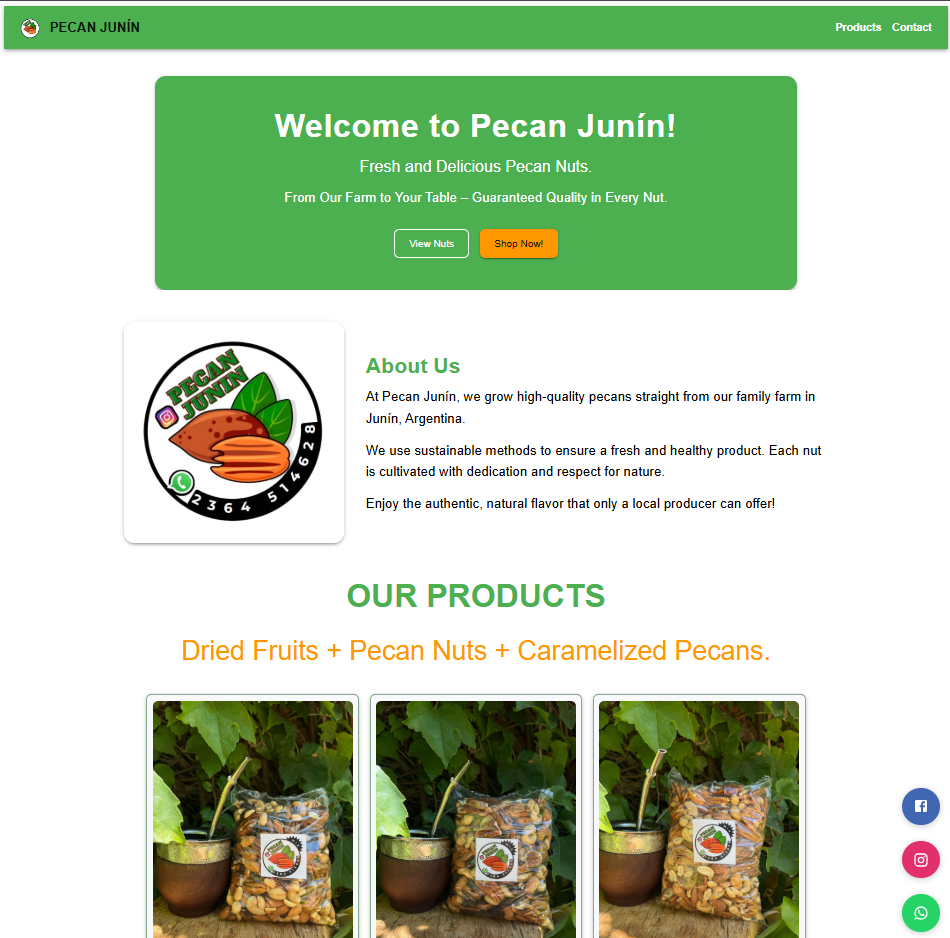
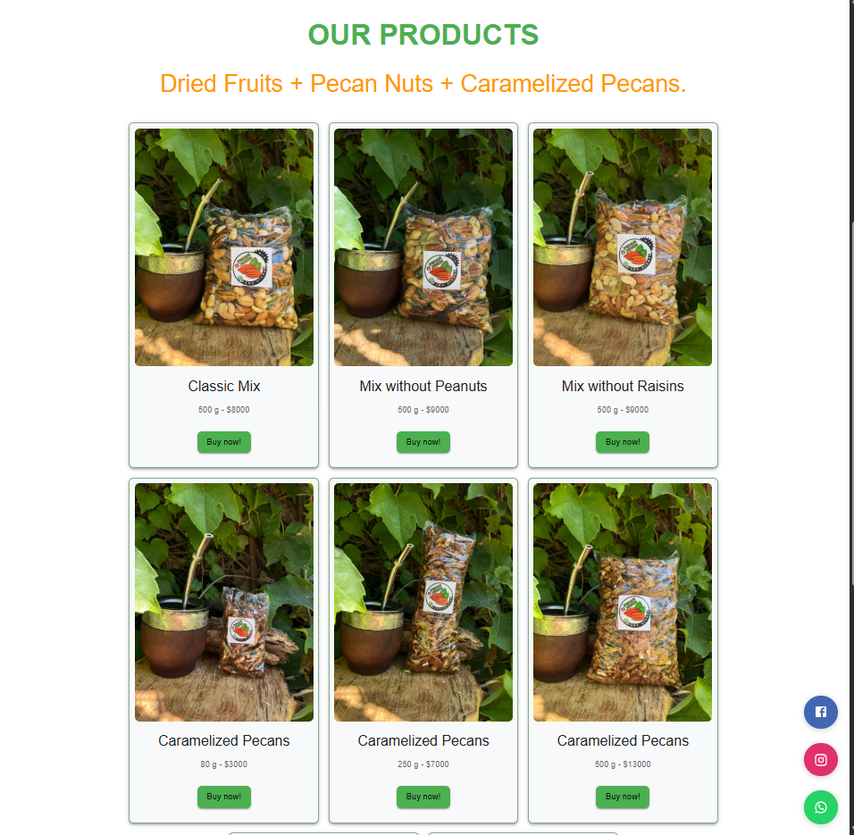

# 🥜 Pecan Junín – Responsive Product Showcase Built with React & MUI

[](https://www.typescriptlang.org/)
[](https://react.dev/)
[](https://mui.com/)
[](LICENSE)

---

## 🧠 About the Project

**Pecan Junín** is a real-world business website built with **React**, **React
Router**, **Material UI**, designed to promote and sell pecan-based products and
dried fruit mixes from our family farm in Junín, Argentina. It includes
**WhatsApp integration**, **countdown promotions**, and a fully **responsive
design** optimized for mobile and tablets.

> 💼 Created as part of my frontend portfolio to demonstrate skills in modern UI
> design and frontend architecture.

## 🚀 Live Demo

👉 [Visit the live site](https://pecan-junin.netlify.app/)

## 🖼️ Preview

### 💚 Homepage



### 🧺 Products



## 🧠 What I Learned

This project helped me solidify skills in **responsive UI with Material UI**,
**component-based architecture**, and **real-world user interaction** with
WhatsApp integration.

---

## 🧠 Features

- ✅ **Fully responsive layout** with mobile-first approach
- ✅ Built using **React + Vite**
- ✅ Styled with **Material UI**
- ✅ Modular structure with reusable components
- ✅ Product cards, price listings and CTA buttons
- ✅ Floating buttons for **Instagram, WhatsApp, and Facebook**
- ✅ **5-minute discount timer** that activates on scroll (simulating urgency)
- ✅ Custom theme with primary/secondary colors
- ✅ Component-based routing with React Router

---

## 🧱 Project Structure

```
src/
├── main.jsx
├── theme.js
├── styless.css
│
├── router/
│   └── AppRouter.jsx
│
├── ui/
│   └── components/
│       └── Navbar.jsx
│
├── pecanjunin/
│   ├── index.js
│   │
│   ├── pages/
│   │   └── HomePage.jsx
│   │
│   └── components/
│       ├── 1-Welcome/
│       │   └── WelcomeComponent.jsx
│       │
│       ├── 2-AboutUs/
│       │   └── AboutComponent.jsx
│       │
│       ├── 3-ProductsSection/
│       │   ├── PecanCard.jsx
│       │   └── ProductTitles.jsx
│       │
│       ├── 4-Discount-Promotions/
│       │   └── DiscountCountdown.jsx
│       │
│       └── 5-SocialMediaButtons/
│           ├── FacebookButton.jsx
│           ├── InstagramButton.jsx
│           └── WhatsAppButton.jsx

```

---

## 🛠️ Stack

- **React** with functional components
- **Vite** for fast dev environment
- **Material UI (MUI)** for UI components
- **React Router v6** for routing
- **CSS Modules** for floating buttons
- **Responsive design** using MUI's `sx` props and breakpoints

---

## 📦 Installation

```bash
# Clone the repository
git clone https://github.com/guillevarelabarros/pecan-junin-business-site.git

# Move into the folder
cd pecan-junin-business-site

# Install dependencies
yarn

# Start development server
yarn dev
```

## 🧑‍💻 Author

**Guille Varela Barros**

- 🔗 LinkedIn: https://www.linkedin.com/in/guillevarelabarros

- 💻 GitHub: https://github.com/guillevarelabarros

## 🔗 Useful Links

- 📹 Demo: https://pecan-junin.netlify.app/

- 💻 Repository: https://github.com/guillevarelabarros/pecan-junin-business-site

## 📌 Notes

This project was developed both as a real-world business website and a showcase
of frontend development skills, focusing on modularity, performance, and mobile
responsiveness.

If you're hiring a frontend developer who knows how to build production-ready
UIs using React, Material UI, and routing systems — let's talk! 🚀
